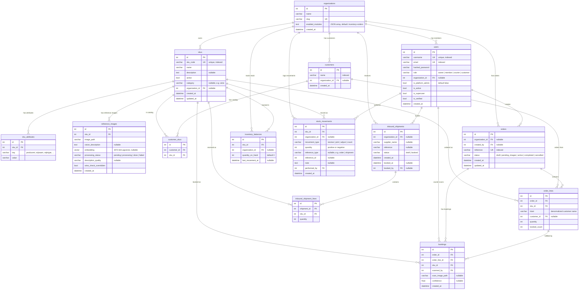
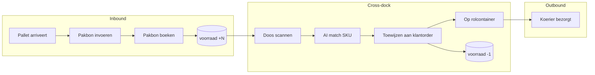

# Database ERD — Inventory Platform

## Operational Flow

## Stock Movement Types

| Type | Trigger | Qty | Description |
|------|---------|-----|-------------|
| `receive` | Pakbon boeken | +N | Goederen ontvangen van leverancier |
| `pick` | Scan/booking | -1 | Doos gescand en op rolcontainer gezet |
| `adjust` | Handmatige correctie | +/- | Correctie door admin/merchant |
| `count` | Fysieke telling | +/- | Delta na telling (saldo bijstellen) |
