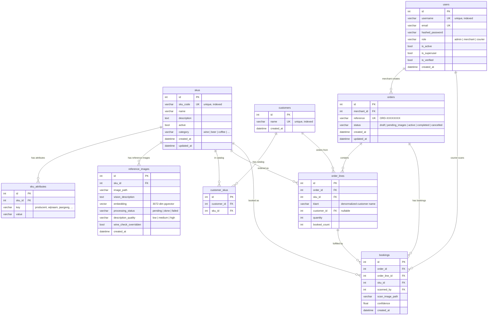
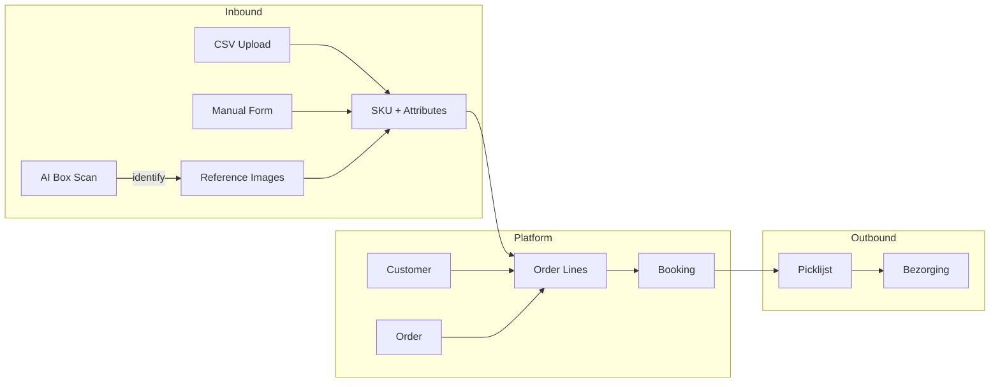

# Database ERD — Inventory Platform

```mermaid
erDiagram
    users {
        int id PK
        varchar username UK "unique, indexed"
        varchar email UK
        varchar hashed_password
        varchar role "admin | merchant | courier"
        bool is_active
        bool is_superuser
        bool is_verified
        datetime created_at
    }

    skus {
        int id PK
        varchar sku_code UK "unique, indexed"
        varchar name
        text description
        bool active
        varchar category "wine | beer | coffee | ..."
        datetime created_at
        datetime updated_at
    }

    sku_attributes {
        int id PK
        int sku_id FK
        varchar key "producent, wijnaam, jaargang, ..."
        varchar value
    }

    reference_images {
        int id PK
        int sku_id FK
        varchar image_path
        text vision_description
        vector embedding "3072-dim pgvector"
        varchar processing_status "pending | done | failed"
        varchar description_quality "low | medium | high"
        bool wine_check_overridden
        datetime created_at
    }

    customers {
        int id PK
        varchar name UK "unique, indexed"
        datetime created_at
    }

    customer_skus {
        int id PK
        int customer_id FK
        int sku_id FK
    }

    orders {
        int id PK
        int merchant_id FK
        varchar reference UK "ORD-XXXXXXXX"
        varchar status "draft | pending_images | active | completed | cancelled"
        datetime created_at
        datetime updated_at
    }

    order_lines {
        int id PK
        int order_id FK
        int sku_id FK
        varchar klant "denormalized customer name"
        int customer_id FK "nullable"
        int quantity
        int booked_count
    }

    bookings {
        int id PK
        int order_id FK
        int order_line_id FK
        int sku_id FK
        int scanned_by FK
        varchar scan_image_path
        float confidence
        datetime created_at
    }

    %% --- Relationships ---

    skus ||--o{ sku_attributes : "has attributes"
    skus ||--o{ reference_images : "has reference images"
    skus ||--o{ customer_skus : "in catalog"
    skus ||--o{ order_lines : "ordered as"
    skus ||--o{ bookings : "booked as"

    customers ||--o{ customer_skus : "has catalog"
    customers ||--o{ order_lines : "orders from"

    users ||--o{ orders : "merchant creates"
    users ||--o{ bookings : "courier scans"

    orders ||--o{ order_lines : "contains"
    orders ||--o{ bookings : "has bookings"

    order_lines ||--o{ bookings : "fulfilled by"
```

## Dataflow

```mermaid
flowchart LR
    subgraph Inbound
        CSV[CSV Upload] --> SKU
        FORM[Manual Form] --> SKU
        SCAN[AI Box Scan] --> |identify| REF[Reference Images]
    end

    subgraph Platform
        SKU[SKU + Attributes]
        REF --> SKU
        SKU --> OL[Order Lines]
        CUST[Customer] --> OL
        ORD[Order] --> OL
        OL --> BOOK[Booking]
    end

    subgraph Outbound
        BOOK --> PICK[Picklijst]
        PICK --> DELIV[Bezorging]
    end
```
